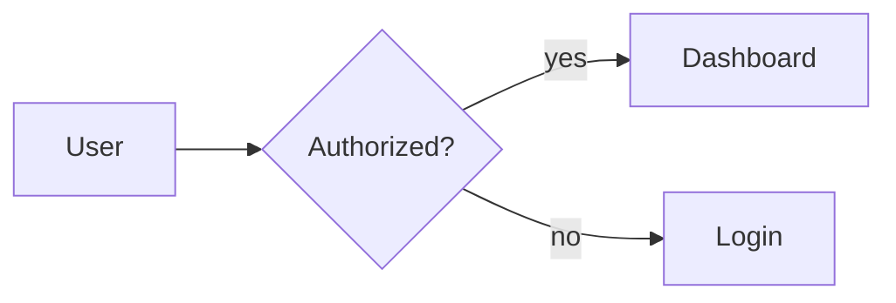
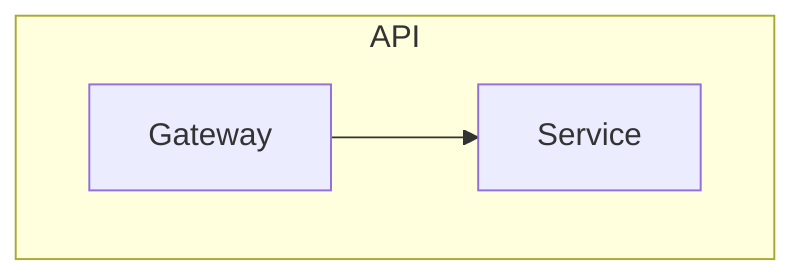
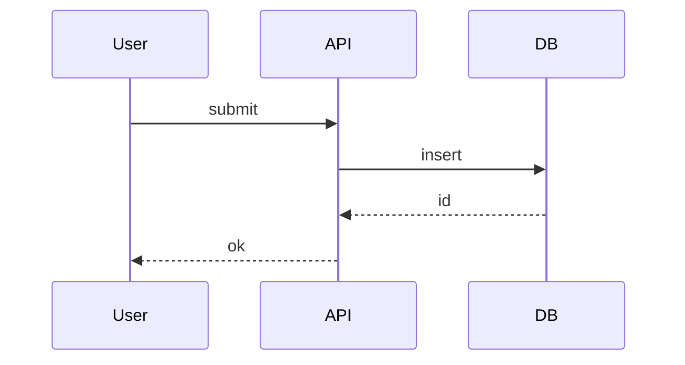
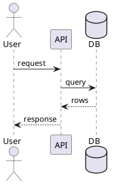
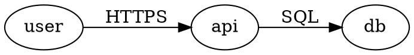

# Conversion guide: Mermaid, PlantUML, Graphviz, prose to D2

Use this guide when the user asks to convert an existing diagram or a whiteboard/prose description into D2.

## General conversion workflow

1. Extract the semantic model: nodes, containers, relationships, labels, order, and boundaries.
2. Choose a D2 diagram type: architecture, flowchart, sequence, ERD, UML class, grid, or composition.
3. Create stable D2 IDs. Preserve original display names as labels.
4. Convert layout direction but do not attempt pixel-perfect placement.
5. Convert repeated visual styles to classes/globs.
6. Validate by rendering when possible.
7. Return source plus notes for any unsupported or intentionally approximated features.

## Mermaid flowchart to D2

Mermaid:



D2:

```d2
direction: right
user: User
authorized: Authorized? { shape: diamond }
dashboard: Dashboard
login: Login

user -> authorized
authorized -> dashboard: yes
authorized -> login: no
```

Mappings:

| Mermaid | D2 |
| --- | --- |
| `flowchart LR` | `direction: right` |
| `flowchart TB` | `direction: down` |
| `A[Label]` | `a: Label` |
| `B{Decision}` | `b: Decision { shape: diamond }` |
| `A --> B` | `a -> b` |
| `A --- B` | `a -- b` |
| edge text | edge label after `:` |
| subgraph | container |
| classDef/class | `classes` and `.class` |

Mermaid subgraph:



D2:

```d2
direction: down
api: API {
  gateway: Gateway
  service: Service
  gateway -> service
}
```

## Mermaid sequence to D2

Mermaid:



D2:

```d2
shape: sequence_diagram
u: User
a: API
d: DB

u -> a: submit
a -> d: insert
d -> a: id
a -> u: ok
```

Notes:

- Mermaid has specialized syntax for activations, alt/opt, and notes. In D2, use nested actor objects for spans, containers for groups, and nested objects on actors for notes.
- Preserve participant order by declaring actors first.

## PlantUML sequence to D2

PlantUML:



D2:

```d2
shape: sequence_diagram
user: User
api: API
db: DB

user -> api: request
api -> db: query
db -> api: rows
api -> user: response
```

## PlantUML class to D2

PlantUML:

```plantuml
class OrderService {
  -repo: OrderRepository
  +createOrder(userId): Order
}
OrderService --> OrderRepository
```

D2:

```d2
OrderService: {
  shape: class
  -repo: OrderRepository
  +createOrder(userId): Order
}
OrderRepository: { shape: class }
OrderService -> OrderRepository
```

## Graphviz / DOT to D2

DOT:



D2:

```d2
direction: right
user -> api: HTTPS
api -> db: SQL
db.shape: cylinder
```

Mappings:

| DOT | D2 |
| --- | --- |
| `digraph` | directed edges with `->` |
| `graph` | undirected edges with `--` |
| `rankdir=LR` | `direction: right` |
| `rankdir=TB` | `direction: down` |
| `subgraph cluster_x` | container |
| node attributes | shape/style attributes |
| edge attributes | edge labels/styles |

DOT cluster:

```dot
subgraph cluster_app {
  label="App";
  web -> api;
}
```

D2:

```d2
app: App {
  web -> api
}
```

## Prose or whiteboard to D2

For prose, extract:

- Actors/users.
- Systems/services/components.
- Data stores, queues, caches.
- Boundaries: regions, networks, domains, teams, trust zones.
- Relationships: protocol, direction, sync/async, data/event names.
- Failure paths or alternate scenarios.

Prompt-to-diagram default:

```d2
direction: right

external: External {
  user: User { shape: person }
}
platform: Platform {
  web: Web App
  api: API
  worker: Worker
}
data: Data {
  db: Database { shape: cylinder }
  queue: Queue { shape: queue }
}

external.user -> platform.web: uses
platform.web -> platform.api: HTTPS
platform.api -> data.db: read/write
platform.api -> data.queue: job
platform.worker -> data.queue: consume
platform.worker -> data.db: update
```

## Conversion quality checklist

- The D2 source uses stable IDs instead of copied labels with punctuation.
- Direction and diagram type preserve the original intent, not every visual detail.
- Subgraphs/subsystems become containers.
- Reused visual styling becomes `classes` or globs.
- Unsupported features are replaced with D2-native equivalents, with a short note if the difference matters.
- The result is maintainable D2, not a line-by-line transliteration that fights the language.
